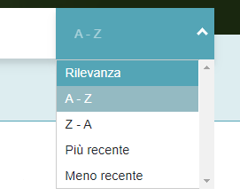

# Cerca  

<hr>  

## Descrizione generale  
La pagina “**cerca**” è la pagina in cui vengono visualizzati gli elementi della ricerca effettuata.  
Permette di ricercare manualmente degli elementi, attraverso una barra di ricerca e, attraverso l’utilizzo di filtri, di scremare ulteriormente la ricerca, sia dalla parte dell’*Archivio*, sia da quella della *Biblioteca* (2 tipologie di filtri differenti).  
È possibile, inoltre, visualizzare i risultati della ricerca secondo diversi tipi d’ordine: “**A-Z**”, “**Z-A**”, “**Più recente**” e “**Meno recente**” e se visualizzarli in formato *griglia* o *elenco*.  
Permette anche di passare alla schermata, precedente o successiva a quella in cui ci si trova, per poter visualizzare gli altri elementi risultati dalla ricerca.  
La selezione di un elemento permette il reindirizzamento alla pagina dell’elemento stesso.  

## Comportamenti specifici  
La pagina è composta dall’unione di diversi componenti: [pagecontainer](pagecontainer.md), [filterbar](filterbar.md), [filterbarBiblioteca](filterbarbib.md), [searchbar](searchbar.md) e [result](result.md).  

- [pagecontainer](pagecontainer.md) → contenitore per l’insieme dei risultati dell’*archivio* e della *biblioteca*.
- [filterbar](filterbar.md) → filtri dell’*archivio*.
- [filterbarBiblioteca](filterbarbib.md) → filtri della *biblioteca*.
- [searchbar](searchbar.md) → barra di ricerca, con filtri “*A-Z*”, “*Z-A*”, “*Più recenti*” e “*Meno recenti*”.
- [result](result.md) → gli elementi risultanti dalla ricerca, le icone di passaggio alle pagine (precedenti e successive) e le icone per mostrare gli elementi risultati secondo una griglia o un elenco.  


```java
import AuiPageContainer from '~/components/pagecontainer/pagecontainer.vue'
import AuiFilterbar from '~/components/cerca/filterbar/filterbar.vue'
import AuiFilterbarBiblioteca from '~/components/cerca/filterbarBiblioteca/filterbarBiblioteca.vue'
import AuiSearchbar from '~/components/cerca/searchbar/searchbar.vue'
import AuiResult from '~/components/cerca/result/result.vue'
```

##

Quando degli elementi nella *query* cambiano (cambio dell’URL del sito: es.https://front.teatrostabile.promemoriagroup.com/cerca?tags=amleto&sort=az&page=0 ...), lo ```store.dispatch``` effettua tre chiamate alla *query*:  

- ```cerca/getFiltri```;

- ```cerca/getData```

- ```cerca/getCountAltro```


```java
let [filtri, data, countAltro] = await Promise.all
```

Queste tre chiamate riconducono a tre diverse azioni presenti nello *store* e cambieranno gli elementi all’interno della *query*.  
La riuscita di queste tre diverse azioni, che vengono eseguite in parallelo, darà come output i risultati per la ricerca effettuata.  

##

```java
watchQuery: ['filtro', 'data', 'tags', 'sort', 'page', 'tab', 'titolo', 'soggetto'], 
async asyncData({store, query})
```

- ```‘filtro’``` → filtri in generale della sezione Archivio.
- ```‘data’``` → filtro data della sezione Archivio.
- ```‘tags’``` → parole ricercate nella barra di ricerca.
- ```‘sort’``` → tipo di ordinamento: “**Rilevanza**”, “**A-Z**”, “**Z-A**”, “**Più recente**” e “**Meno recente**”.
- ```‘page’``` → impaginazione dei risultati ( ‘**<**’  o  ‘**>**’    es. page 1, page 2…).
- ```‘tab’``` → sezione Archivio o Biblioteca.
- ```‘titolo’``` → filtro della sezione Biblioteca.
- ```‘soggetto’``` → altro filtro della sezione Biblioteca.

##

La prima azione richiama il metodo ```getFiltri()``` nel *cerca.js* contenuto nello *store*.  
Corrisponde alla chiamata/selezione dei filtri di *Archivio* e *Biblioteca*.  

```java
store.dispatch('cerca/getFiltri', {
	queryTags,
	filtriSelezionati,
	filtriDataSelezionati,
	titolo,
	soggetto,
	tab
}),
```

<center></center>

##

La seconda azione richiama il metodo ```getData()``` nel *cerca.js* contenuto nello *store*.  
Corrisponde alla chiamata dei risultati della ricerca.  

```java
store.dispatch('cercs/getData', {
	queryTags,
	filtriSelezionati,
	skip,
	limit,
	'sort': orderByComputed.currentSort.query,
	titolo,
	soggetto,
	tab,
	showInitialResult
}),
```
<center></center>

##

La terza azione richiama il metodo ```getCountAltro()``` nel *cerca.js* contenuto nello *store*.  
Corrisponde alla chiamata del numero di risultati ottenuti o in *Archivio* o in *Biblioteca*.  

```java
store.dispatch('cerca/getCountAltro', {
	queryTags,
	tab: tab === tabArchivio ? tabBiblioteca : tabArchivio
})
```
<center></center>
<center></center>

## 

## I Filtri:

Il vettore ```sortOptions``` mostra i diversi tipi di ordinamento per gli elementi: “*A-Z*”, “*Z-A*”, “*Più recenti*” e “*Meno recenti*”. Questi tipi sono gestiti dal metodo ```updateSort()```.  

```java
updateSort (option){
	if (option && this.orderBy.currentSort.value !== option.value){
		this.orderBy.currentSort = option
		this.aggiornaQuery()
	}
},
```
<center></center>

##

### Il metodo ```nextPage()```:  
permette di mostrare la pagina successiva, a quella in cui ci si trova, contenente i restanti risultati della ricerca effettuata (es. page 1 → page 2).  

```java
nextPage (){
	this.skip = this.skip + 1
	this.aggiornaQuery(true)
},
```
Click sulla freccia: <center></center>

##

### Il metodo ```prevPage()```:  
permette di mostrare la pagina precedente, a quella in cui ci si trova, contenente i restanti risultati della ricerca effettuata (es. page 2 → page 1).  

```java
prevPage (){
	thi.skip = this.skip - 1
	this.aggiornaQuery(true)
},
```
Click sulla freccia: <center></center>

##

### Il metodo ```switchTab()```:  
permette di passare dalla sezione *Archivio* a quella *Biblioteca* e viceversa, cancellando i filtri che si erano selezionati.  

```java
switchTab (){
	this.filtriSelezionati = []
	this.filtriDataSelezionati = {
		from: '',
		to: ''
	}
}
```
##

## 1) Per la sezione Archivio (filtri):  
### Il metodo ```setFiltro()```:  
aggiunge il filtro selezionato all’insieme di filtri già in uso per la ricerca che si sta effettuando e aggiorna la ricerca.  

```java
setFiltro (){
	this.filtriSelezionati.push(filtro)
	this.aggiornaQuery()
},
```

##

### Il metodo ```removeFiltro()```:  
rimuove il filtro selezionato, attraverso un indice che corrisponde all’id del filtro, dall’insieme di filtri già in uso per la ricerca che si sta effettuando e aggiorna la ricerca.  

```java
removeFiltro (){
	var index = _.findIndex(this.filtriSelezionati, item => item.id === filtro.id)
	this.filtriSelezionati.splice(index, 1)
	this.aggiornaQuery()
},
```

##

### Il metodo ```removeAllFilters()```:  
se vi è più di un filtro selezionato, cliccando su “**RIMUOVI TUTTI**”, vengono rimossi tutti i filtri e mostrati di nuovo tutti gli elementi contenuti nell’archivio.  

```java
removeAllFilters (){
	this.filtriSelezionati = []
	this.aggiornaQuery()
},
```
</center>


##

### Il metodo ```setDataFiltri()```:  
permette la selezione di un range di tempo (*from → to*) che selezionerà solo gli elementi compresi in quelle date.  

```java
setDataFiltri (filtriDataSelezionati){
	this.filtriDataSelezionati = {
		from: filtriDataSelezionati.from ? filtriDataSelezionati.from.getTime() : '',
		to: filtriDataSelezionati.to ? filtriDataSelezionati.to.getTime : ''
	}
	this.aggiornaQuery()
},
```
<center></center>

##

## 2) Per la sezione Biblioteca (filtri):  
### Il metodo ```setAdvSearch()```:  
permette di aggiungere ai filtri solo un autore e un genere, selezionabili tramite un menù, mentre filtra, svolgendo una ricerca, per titolo e soggetto che vengono inseriti manualmente dall’utente.  

```java
setAdvSearch (params){
	this.filtriSelezionati = []
	if (params.autore) {
		this.filtriSelezionati.push(params.autore)
	}
	if (params.genere){
		this.filtriSelezionati.push(params.genere)
	}
	this.titolo = params.titolo
	this.soggetto = params.soggetto
	this.aggiornaQuery()
},
```