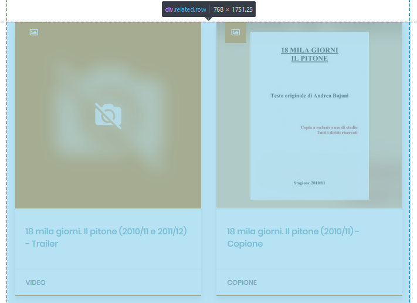
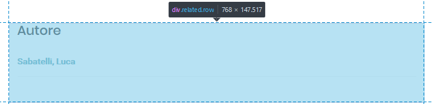

# Related  

<hr>  

##

- Il componente "**related**" è una classe *html* ```class="related row"``` che contiene, sotto forma di "*card*" con preview o di elenco, tutte le opere, le immagini, i video, l'autore... collegate tramite una relazione a un elemento.  

<center>


</center>

##

- Richiama il componente: [card-view](cardview.md).  

```java
import AuiCard from '~/components/item-view/card-view/card.vue'
```
##

- Prende in input le proprietà ```relateds``` e ```view```.  

```java
props: [
    'relateds',
    'view'
]
```