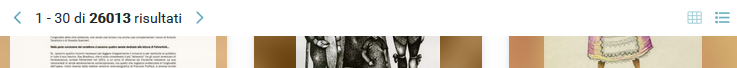
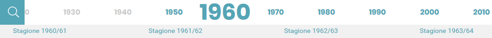
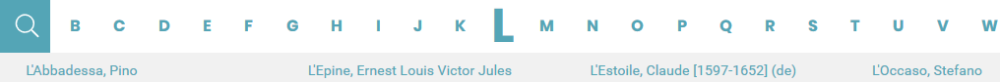

# Sticky  

<hr>  

## Descrizione generale  
Il componente “**sticky**” permette che, successivamente allo scroll verso il basso della pagina, l’elemento a cui è associato rimanga incollato in cima alla schermata visualizzata dell’utente.  
Nella pagina cerca (*Archivio*) comprende: i bottoni (“**<**” e “**>**”) per la visualizzazione successiva o precedente delle pagine dei risultati e le icone per la loro visualizzazione a *griglia* o a *elenco*.  
Nelle altre pagine del menu a comparsa, escluse Home e [Cerca](cercapg.md), è l’insieme di *date* o le *lettere alfabetiche* che, se selezionate, permettono lo scorrimento della pagina fino alla sezione corrispondente.  

## Comportamenti specifici  
Importa la libreria ```stickybits``` e la applica all’elemento aggiungendogli il tag **<aui-sticky\>** **</aui-sticky\>** nel codice *.htlm*; questo farà in modo che l’elemento rimanga incollato in cima alla schermata anche durante lo scroll verso il basso.  

```java
import stickybits from 'stickybits'
```
##

```html
<aui-sticky class= "bg-white row" v-if="nav !== 'none'">   [...]   </aui-sticky>
```
<center></center>

##
##

```html
<aui-sticky class= "col-md-12 resultnavi mb-b">   [...]   </aui-sticky>
```

<center></center>
<center></center>
